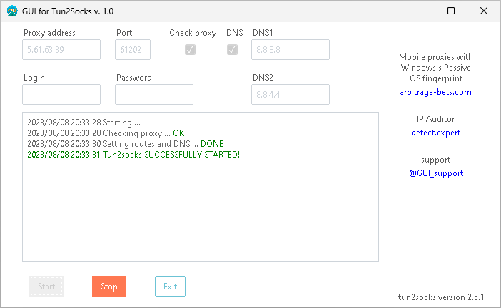

## GUI_tun2socks
Программа является графической оболочкой для официального проекта [tun2socks](https://github.com/xjasonlyu/tun2socks). Поддерживает протокол UDP. Для виртуального сетевого интерфейса использует драйвер wintun. После каждого цикла удаляет за собой настройки из таблицы маршрутизации, сетевой профиль и восстанавливает настройки DNS, если они применялись. Тестирование программы проводилось на ОС Windows 10 и Windows 11. Совместимость с другими версиями Windows не проверялась. При возникновении неполадок обратитесь в [техподдержку](https://t.me/GUI_support).

### Запуск программы
Скачайте дистрибутив [GUI_tun2socks.zip](https://github.com/sova2022/GUI_tun2socks/releases/download/v.1.0/GUI_tun2socks.zip) на странице [релизов](https://github.com/sova2022/GUI_tun2socks/releases/). Дистрибутив содержит готовый для запуска код программы. Установка Python3 не требуется. Распакуйте архив с дистрибутивом в любое место на диске и запустите программу GUI_tun2socks.exe. При запуске предоставьте программе права администратора.

### Запуск исходного кода

Для запуска исходного кода программы на языке Python3 необходимо иметь установленные в системе Python3 и pip и выполнить следующие шаги.
1. Запустить командную строку Windows (Win+R --> cmd --> Enter) и выполнить в ней дальнейшие команды.
1. `python -m venv C:\any\path\you\like\packenv`, где `\any\path\you\like` - любое удобное место на диске `C`, а `packenv` - имя папки с виртуальным окружением Python3, которая будет создана при выполнении данной команды.
1. `cd C:\any\path\you\like\packenv`
1. Активировать виртуальное окружение, введя `.\Scripts\activate.bat`
1. `git clone https://github.com/sova2022/GUI_tun2socks.git` (либо скачать архив программы через браузер, выбрав в верхней правой части данной страницы зелёную клавишу `Code`, далее `Download zip`. Распаковать архив в `C:\any\path\you\like\packenv`
1. Перейти в папку с программой `cd GUI_tun2socks` (либо `cd GUI_tun2socks-main\GUI_tun2socks-main`)
1. Установить зависимости командой `pip install -r requirements.txt`
1. Запустить скрипт: `python3 GUI_tun2socks.py`

При запуске предоставьте программе права администратора.

### Сборка дистрибутива

Для сборки дистрибутива выполните шаги 1-7 из предыдущего раздела, после чего запустите скрипт `.\build.bat`

В результате вы получите готовый дистрибутив в папке `.\dist\GUI_tun2socks` с самой программой (GUI_tun2socks.exe) и всеми необходимыми файлами для её работы. Можете скопировать данную папку в любое удобное место или создать из неё zip-архив для переноса на другой компьютер.
